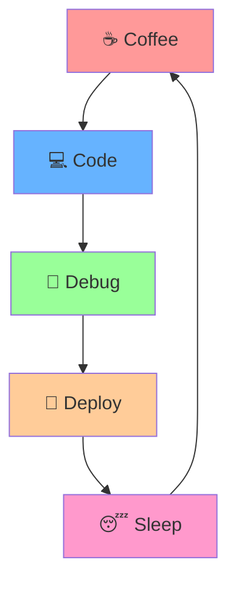

# 🚀 Welcome to My Digital Universe

<div align="center">
  
</div>

<div align="center">
  
</div>

## 🎯 About Me

```javascript
const developer = {
  name: "G K Madhushani Perera",
  location: "Tangalle",
  education: "🎓 Information Technology Undergraduate",
  roles: ["Full Stack Developer", "Cloud Architect", "AI Enthusiast"],
  currentFocus: [ "Machine Learning", "DevOps","Cloud Engineer"],
  communities: {
    founder: ["Tech Innovators"],
    member: ["Open Source Contributors", "AI Researchers"]
  },
  lifePhilosophy: "Code is poetry, bugs are just unfinished verses 🎭"
};
```

<div align="center">
  
  
</div>

## 🛠️ Tech Arsenal

<div align="center">

### 💻 Core Technologies


### 🌐 Web Technologies


)


### ☁️ DevOps & Cloud


### 🔧 Tools & Systems


</div>

## 📊 GitHub Analytics

<div align="center">
  
</div>

<div align="center">
  
</div>

## 🔥 My Contributions

<div align="center">
  
</div>

## 🌟 Featured Projects

<div align="center">

[](https://github.com/PereraMadhushani/project1)
[](https://github.com/PereraMadhushani/project2)

</div>

## 🌈 Fun Facts

<div align="center">



</div>

- 🎮 **Gaming**: When not coding, I'm probably speed-running indie games
- 🎵 **Music**: I code better with lo-fi beats and synthwave
- 📚 **Learning**: Currently diving deep into quantum computing
- 🌱 **Green Tech**: Passionate about sustainable technology solutions
- 🤖 **AI Ethics**: Advocate for responsible AI development

## 📈 Profile Insights

<div align="center">
  
  
  
</div>

## 🤝 Connect & Collaborate

<div align="center">

### Let's build something amazing together! 🚀

[](https://madhushani-perera-hxhc.vercel.app/)
[](https://linkedin.com/in/madhushani-perera)
[](mailto:your.kaushalyam234@gmail.com)

</div>

---

<div align="center">
  
  
  **"The best way to predict the future is to create it."** 💫
  
  <sub>⭐️ From [PereraMadhushani](https://github.com/PereraMadhushani)</sub>
</div>
